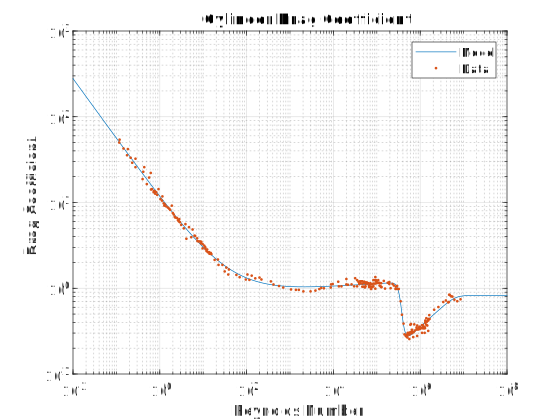

# CylinderDragFits
A proper curve fit for both sub- and supercritical cylinder flows. 

This analysis provides a single, universally-applicable curve fit for drag coefficient over a cylinder for a wide range of Reynolds numbers ranging from 1e-1 to 1e7.

Why doesn't this exist already in the literature?!

Data from Wiley, "Incompressible Flow" (4th Ed.).
